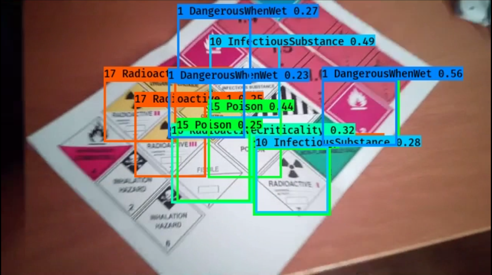

# Hazardmap detector

## Introduction

A detector of hazard labels using YOLO in tensorflow (Source: https://github.com/qqwweee/keras-yolo3).

## Quick Start

Running main.py initializes the the network and the dataset and starts the training.

## Files

- main.py - runs other scripts as needed
- dataset.py - generates the dataset by modifying hazard labels and placing them on various downloaded images
- train.py - trains and tests the network, based on suggested implementations by keras-yolo3
- config.py - configuration of all parts of the process, generally the only file that needs to be touched

## Results

The dataset contains images such as this with annotations in a separate file:

So far only a simplified network (yolo-tiny) has been run on a simplified dataset and is able to find most labels
correctly but doesn't classify them correctly:

